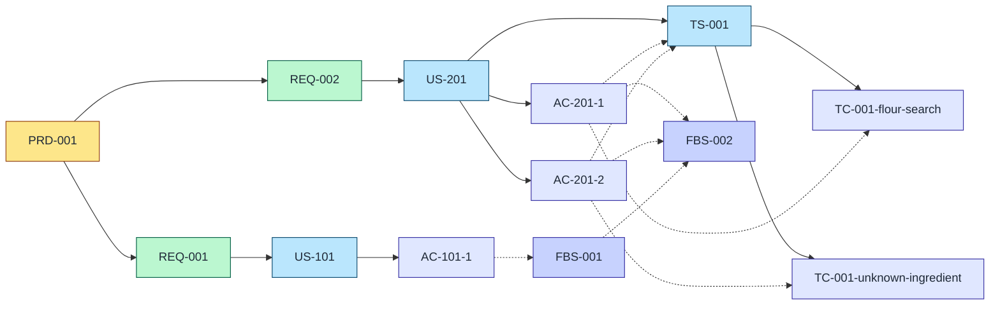

# How it works

## 1. Read this if

You want the mental model: what the documents are, how they connect, and what the tool guarantees. Written for the human evaluator deciding whether to trust the method; the exit-code and MCP contract sections serve operating agents too. No installation steps here ([install](install.md)) and no journey ([getting started](getting-started.md)).

## 2. The document chain

RCF keeps one machine-checkable chain from product intent to test evidence:

- **The requirement spine:** PRD -> REQ -> US -> AC -> TS -> TC. A product requirements document owns requirements; each requirement owns user stories; each story owns testable acceptance criteria; test suites own test cases; each test case verifies exactly one acceptance criterion.
- **The architecture side chain:** TAD -> TAC / ADR. A technical architecture document owns components and decision records. Stories cross-link to the components that realise them.
- **The build queue:** BS -> FBS. A build sequence owns feature build specs - ordered, dependency-aware work items, each pinned to the acceptance criteria it delivers.

One line per document type, with the field-level reference linked (field tables live in the schemas repo, not here):

| Type | Is | Reference |
|---|---|---|
| PRD | The product: problem, objectives, scope | [prd](https://github.com/Stravica/rcf-schemas/blob/main/docs/prd.md) |
| REQ | One requirement the product must meet | [req](https://github.com/Stravica/rcf-schemas/blob/main/docs/req.md) |
| US | One user story under a requirement, with inline ACs | [user-story](https://github.com/Stravica/rcf-schemas/blob/main/docs/user-story.md) |
| AC | One testable acceptance criterion | inline in [user-story](https://github.com/Stravica/rcf-schemas/blob/main/docs/user-story.md) |
| TS | A test suite owning test cases, with inline TCs | [test-suite](https://github.com/Stravica/rcf-schemas/blob/main/docs/test-suite.md) |
| TC | One test case verifying one AC | inline in [test-suite](https://github.com/Stravica/rcf-schemas/blob/main/docs/test-suite.md) |
| TAD | The architecture document | [tad](https://github.com/Stravica/rcf-schemas/blob/main/docs/tad.md) |
| TAC | One architecture component | [tac](https://github.com/Stravica/rcf-schemas/blob/main/docs/tac.md) |
| ADR | One architecture decision record | [adr](https://github.com/Stravica/rcf-schemas/blob/main/docs/adr.md) |
| BS | The build sequence (queue root) | [build-sequence](https://github.com/Stravica/rcf-schemas/blob/main/docs/build-sequence.md) |
| FBS | One feature build spec (queue item) | [fbs](https://github.com/Stravica/rcf-schemas/blob/main/docs/fbs.md) |

The product draws its own diagrams. This is the [getting started](getting-started.md) project's tree, exactly as `rcf trace PRD-001 --forward --format mermaid` emitted it - solid arrows are ownership, dotted arrows are cross-links:


```mermaid
flowchart LR
  PRD-001["PRD-001"]
  REQ-001["REQ-001"]
  REQ-002["REQ-002"]
  US-101["US-101"]
  US-201["US-201"]
  AC-101-1["AC-101-1"]
  TS-001["TS-001"]
  AC-201-1["AC-201-1"]
  AC-201-2["AC-201-2"]
  FBS-001["FBS-001"]
  TC-001-flour-search["TC-001-flour-search"]
  TC-001-unknown-ingredient["TC-001-unknown-ingredient"]
  FBS-002["FBS-002"]
  PRD-001 --> REQ-001
  PRD-001 --> REQ-002
  REQ-001 --> US-101
  REQ-002 --> US-201
  US-101 --> AC-101-1
  US-201 --> TS-001
  US-201 --> AC-201-1
  US-201 --> AC-201-2
  AC-101-1 -.-> FBS-001
  TS-001 --> TC-001-flour-search
  TS-001 --> TC-001-unknown-ingredient
  AC-201-1 -.-> TS-001
  AC-201-1 -.-> TC-001-flour-search
  AC-201-1 -.-> FBS-002
  AC-201-2 -.-> TS-001
  AC-201-2 -.-> TC-001-unknown-ingredient
  AC-201-2 -.-> FBS-002
  FBS-001 -.-> FBS-002
  class PRD-001 prd;
  class REQ-001 req;
  class REQ-002 req;
  class US-101 us;
  class US-201 us;
  class AC-101-1 ac;
  class TS-001 us;
  class AC-201-1 ac;
  class AC-201-2 ac;
  class FBS-001 fbs;
  class TC-001-flour-search ac;
  class TC-001-unknown-ingredient ac;
  class FBS-002 fbs;
classDef prd fill:#fde68a,stroke:#92400e,color:#1f2937;
  classDef req fill:#bbf7d0,stroke:#065f46,color:#1f2937;
  classDef us fill:#bae6fd,stroke:#0c4a6e,color:#1f2937;
  classDef ac fill:#e0e7ff,stroke:#3730a3,color:#1f2937;
  classDef tad fill:#fecaca,stroke:#991b1b,color:#1f2937;
  classDef tac fill:#fed7aa,stroke:#9a3412,color:#1f2937;
  classDef adr fill:#fbcfe8,stroke:#9d174d,color:#1f2937;
  classDef bs fill:#ddd6fe,stroke:#5b21b6,color:#1f2937;
  classDef fbs fill:#c7d2fe,stroke:#3730a3,color:#1f2937;
classDef broken stroke:#dc2626,stroke-width:2px,stroke-dasharray:5 5,color:#7f1d1d;
```

## 3. Files on disk

Everything is a JSON file in your repo, under a top-level `rcf/` directory: the PRD, TAD and build sequence as single files, and per-document files under `requirements/`, `user-stories/`, `tacs/`, `adrs/`, `fbs/` and `test-suites/`. The [rcf-schemas file-layout doc](https://github.com/Stravica/rcf-schemas/blob/main/docs/file-layout.md) specifies the convention; [id-conventions](https://github.com/Stravica/rcf-schemas/blob/main/docs/id-conventions.md) covers the id grammar.

`rcf/manifest.json` declares exactly three roots: the PRD, the TAD and the BS. Nothing else is registered anywhere. Every other document is discovered by walking parent references - each child names its parents (`prdId`, `reqId`, `tadId`, `bsId`), never the other way round. Edges live on the child because that is what survives change: adding a story never edits the requirement, so documents do not accumulate drift in lists they do not own.

Two practical consequences. First, the tree is git-native - documents diff, merge and review like any other code. Second, there is no index to corrupt: delete a file and the next walk simply reports the hole.

## 4. Validation model

Two layers, both mechanical:

1. **Schema validation** - every document validates against its [rcf-schemas](https://github.com/Stravica/rcf-schemas) contract. The CLI validates on every write, and `rcf validate` checks the whole tree, which covers hand edits too.
2. **Reference integrity** - the walk checks that every referenced id exists: a US naming an unknown REQ, an FBS naming a deleted AC, a TC pinned to a criterion that has gone.

Anywhere in the CLI, exit 3 means one of those two layers failed: the tree itself is unsound. This is what makes the tree trustworthy as an input to automation - a clean `rcf validate` is a machine-checkable precondition, not a hope.

## 5. The verb map

Twenty-nine subcommands under the single `rcf` bin, grouped by job:

| Job | Verbs |
|---|---|
| Scaffold | `init` |
| Author | `create`, `update`, `delete`, `link`, `unlink`, `fbs`, `test-suite` |
| Inspect | `read`, `view` |
| Trust | `validate`, `coverage`, `trace`, `impact`, `doctor`, `review` |
| Build | `build`, `preflight`, `finalise` |
| Design | `ui-classify`, `ui-baseline`, `design`, `browser-verify` |
| Elicit | `intake`, `req-classify`, `req-baseline` |
| Agent | `mcp`, `guidance` |
| Help | `help` |

Elicitation-side verbs (Track C+D of the 0.7.0 train) sit alongside the rest: `intake` classifies whatever the operator supplied at project start (napkin through PRD-plus-TAD), runs a validation pass over the artefact and records the result on the manifest before elicitation begins; `req-classify` runs the REQ-shape classifier on demand (the classifier also fires automatically on `rcf create req` and `rcf update req --description`) so downstream tooling has a fresh `shapeClassification` block; `req-baseline` runs the baseline-AC sweep (per REQ or across the whole tree) and manages the opt-out ledger. The Stage-1 (Define) build gate refuses `rcf build --next` for any FBS binding an AC on a US that still has open baseline candidates.

One line each: `init` scaffolds a new tree; `create`/`update`/`delete` write documents through schema validation; `link`/`unlink` manage the US-to-TAC cross-links; `fbs <fbs-id> depends-on` records a third-party service dependency on an FBS; `test-suite <ts-id> provenance` records how a test case verified its AC and `test-suite <ts-id> approve` promotes the suite's authoringStatus to `approved`; `read` prints a document, `view` serves the whole tree as a live local page; `validate` checks the tree, `coverage` reports the REQ-to-TC picture, `trace` walks the graph from an id, `impact` turns a change into a re-check list; `doctor` diagnoses init-hygiene drift (managed CLAUDE.md/AGENTS.md block, managed `.gitignore` block, seeded `rcf/knowledge/` and `rcf/.identity/`) and `doctor --fix` applies the safe minimal repair without touching operator content; `review <fbs-id>` runs the REVIEW-stage test-theatre audit and mutation-sampling pass, including the Track B `uiBaselineDrift` category for UI-bearing FBSes; `build` assembles FBS spec bundles and drives the queue; `preflight` elicits the pre-flight service-attestation record and any applicable design-shape answers; `finalise` is the ship gate - it runs the independent `rcf-verify` verifier against your deployed app as a fresh subprocess and promotes the FBS from `complete` to `verified` only when it passes; `ui-classify <fbs-id>` runs the UI-bearing classifier on demand; `ui-baseline` manages the project's ruled UI defaults (init, show, opt-out); `design <fbs-id>` writes the Design substage artefacts (journeys, nav model, theme and accessibility) and marks the design complete; `browser-verify <fbs-id>` runs the Stage 5 browser-verification gate against the local preview or a deployed URL; `mcp` serves everything to agents over stdio; `guidance` prints a method document out of the installed package, which is how a CLI-only agent reads the playbooks that MCP-wired harnesses get as `rcf://docs/<slug>` resources and `rcf_*` prompts.

Flags are deliberately not documented here: `rcf help <verb>` is the canonical, tested, ships-with-the-bin flag reference for every one of them.

## 6. The agent contract

The tool is built to be operated by agents, so its contracts are explicit:

**Exit codes.** Uniform across every verb:

| Code | Meaning |
|---|---|
| 0 | Success |
| 1 | IO or unexpected runtime failure |
| 2 | Usage error (bad flags, unknown id) |
| 3 | Schema validation failed or references broken |
| 4 | Refused (delete with dependents, backward lifecycle transition, strict-mode gap) |

(`rcf view`, a long-running server, additionally exits 130 on Ctrl-C.)

**Machine output.** The query verbs (`rcf coverage`, `rcf trace`, `rcf impact`) and `rcf build` take `--format json`; `rcf validate` takes `--json`; the write verbs (`rcf create`, `rcf update`, `rcf delete`, `rcf link`, `rcf unlink`) take `--dry-run` to print the intended writes without executing. JSON shapes are stable by convention: they change only deliberately and with notice in the changelog, not as a side effect.

**MCP.** `rcf mcp` serves the same contract over the Model Context Protocol - local stdio only, project root fixed at startup, protocol revision `2025-11-25`. The server declares tools, resources and prompts:

- **Eleven tools**, each a thin in-process wrapper over the same modules the CLI uses, returning identical JSON envelopes: `rcf_validate`, `rcf_coverage`, `rcf_trace`, `rcf_impact`, `rcf_read`, `rcf_create`, `rcf_update`, `rcf_delete`, `rcf_link`, `rcf_unlink`, `rcf_build`. There are deliberately no `rcf_init` or `rcf_view` tools - scaffolding and the browser view stay on the CLI side. `rcf_build` takes FBS ids only, and outcomes an agent must reason about - strict coverage gaps, blocked bundles - come back as data in the envelope, not as tool errors. Each tool's declared output schema is the union of the success envelope and the error payload; do not assume a success-only shape.
- **Resources:** `rcf://tree` (the document index), `rcf://doc/<id>` (every document, inline ACs and TCs included), and four methodology docs served from `guidance/`: `rcf://docs/overview`, `rcf://docs/document-model`, `rcf://docs/build-cycle`, `rcf://docs/harness-template`.
- **Prompts:** two argument-free agent playbooks, `rcf_execute_build_cycle` (drive the build loop well) and `rcf_elicit_requirements` (draw a valid tree out of a conversation).

Registration is one config entry: [install, section 7](install.md#7-wire-into-an-agent-harness).

## 7. This repository as the worked example

Build Lite is built with RCF. The tree under [`rcf/`](../rcf) is not a demo fixture - it is the product's own PRD (PRD-001), eight requirements, twenty-four user stories, a TAD with eight components and nine decision records, and a fourteen-item build queue that drove the phases you are reading the output of. Every command on this page runs against this repository's own tree; clone it and run them yourself.

```sh
rcf read REQ-004 --field title
```

```
"Traceability and query over the RCF chain"
```

```sh
rcf trace US-201 --both
```

```
Trace pivot: US-201  direction: both

Ancestors:
Depth  Id       Kind  Title
-----  -------  ----  -----
-1     REQ-002  req
-2     PRD-001  prd

Pivot: US-201

Descendants:
Depth  Id        Kind  Title
-----  --------  ----  -----
1      AC-201-1  ac
1      AC-201-2  ac
1      AC-201-3  ac
2      FBS-003   fbs
```

```sh
rcf impact TAC-001
```

```
Impact pivot: TAC-001

Id       Kind  Role        Action needed
-------  ----  ----------  -------------
TAC-001  tac   pivot       -
TAD-001  tad   ancestor    review-arch
FBS-001  fbs   descendant  re-execute
FBS-002  fbs   descendant  re-execute
FBS-005  fbs   descendant  re-execute
FBS-006  fbs   descendant  re-execute
FBS-003  fbs   descendant  re-execute
FBS-004  fbs   descendant  re-execute
FBS-008  fbs   descendant  re-execute
FBS-007  fbs   descendant  re-execute
FBS-012  fbs   descendant  re-execute
FBS-009  fbs   descendant  re-execute
FBS-010  fbs   descendant  re-execute
FBS-011  fbs   descendant  re-execute
```

"If the document store changes, every build item needs re-checking" - which is true, and exactly the kind of statement the tree exists to make checkable.

Now the honest part:

```sh
rcf coverage
```

```
Coverage mode: shallow-any
Requirements: 8  covered: 8  covered-unresolved: 0  uncovered: 0

Requirement  Covered  AC        AC covered  Test cases
-----------  -------  --------  ----------  ------------------------------------------------------------
REQ-001      yes      AC-101-1  yes         TC-001-init-clean-tree-roots
                      AC-101-2  yes         TC-001-init-refuses-overwrite
                      AC-101-3  yes         TC-001-children-discoverable-from-roots
                      AC-102-1  yes         TC-002-walk-loads-every-document
                      AC-102-2  yes         TC-002-parse-failure-structured-no-crash
                      AC-102-3  yes         TC-002-broken-reference-reported
```

(The remaining seven requirement blocks are elided here; run it from a clone for the full table.)

Eight of eight - but shallow-any is the generous reading, and the strict one is the honest one. This tree's test-suite documents bind all 76 acceptance criteria to named tests in the repo's own suite, and every binding is load-bearing: each test case carries a `testPointer` that must resolve to a real, named test in the working tree, or it is reported as `covered-unresolved` rather than covered. `rcf coverage --strict` exits 0 against this tree - and it did not always: the audit that built this test axis found 14 acceptance criteria with no genuine outcome-asserting test, registered every one in `rcf/test-suites/PENDING.md` rather than stubbing test cases, and held strict mode at exit 4 until the last row closed. The last row was the referee catching a real defect: an AC the tree claimed was delivered (parallel-safe build groups) that the code never implemented - the feature was built and bound before the register could empty. CI now runs `rcf validate` and `rcf coverage --strict` on every push and pull request, so the strict verdict is a gate, not a report: a stub test case or a new uncovered AC fails the build. That is the behaviour you want from the referee.

## 8. Under the hood, briefly

One walker underpins every verb: load all documents from the manifest's three roots, then invert the child-declared edges into the forward maps that queries need. Each CLI invocation performs exactly one walk; `rcf view` keeps a watcher on `rcf/` and re-walks on change, pushing the fresh tree to the browser over server-sent events. That is the whole engine. The deeper reference is the product's own TAD - `rcf/tad.json` in this repo, best read through `rcf view`.

## 9. What "Lite" means

Lite refers to the user effort, not the rigour. The full RCF discipline - the chain, the validation, the coverage gate, the build queue - is all here; the tooling absorbs the clerical work the method used to demand (id assignment, edge bookkeeping, schema conformance, bundle assembly). Where the full-strength framework asks an engineering team to maintain the chain, Build Lite asks a product owner and an agent to answer questions about their product. Why that trade is the point is [why it exists](why-it-exists.md).
